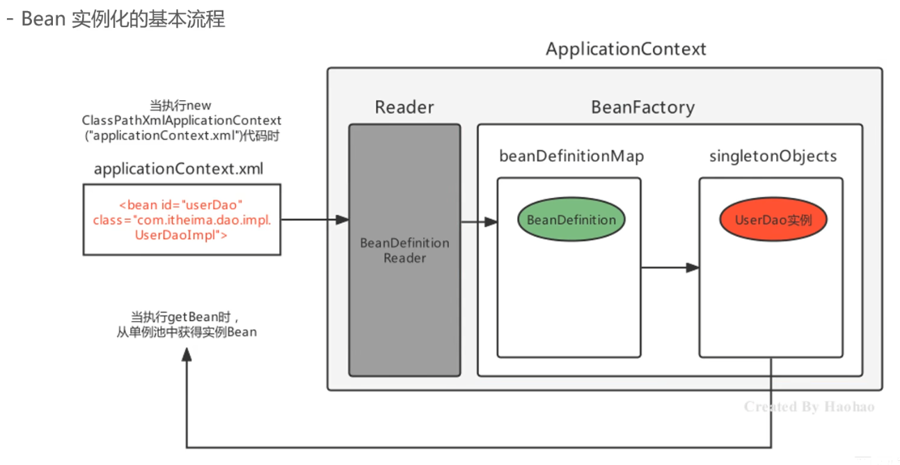
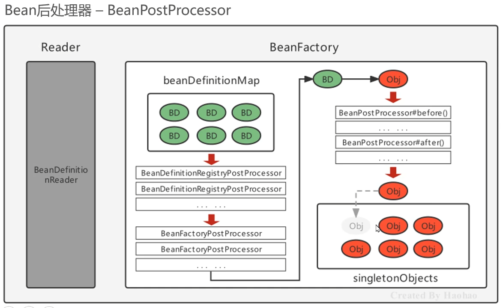
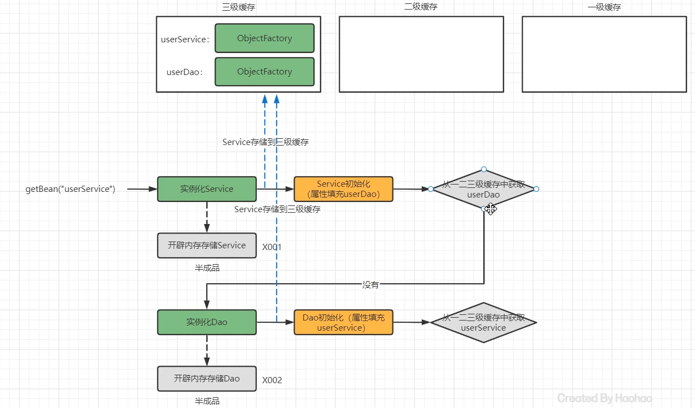
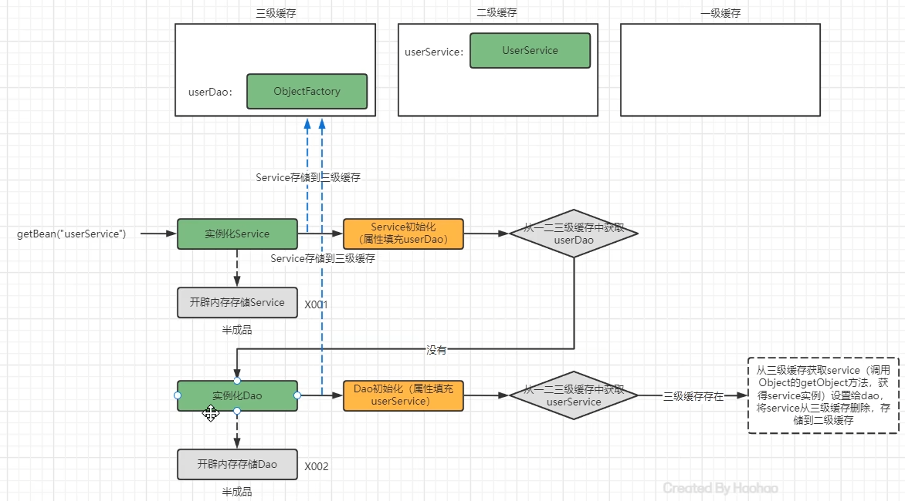
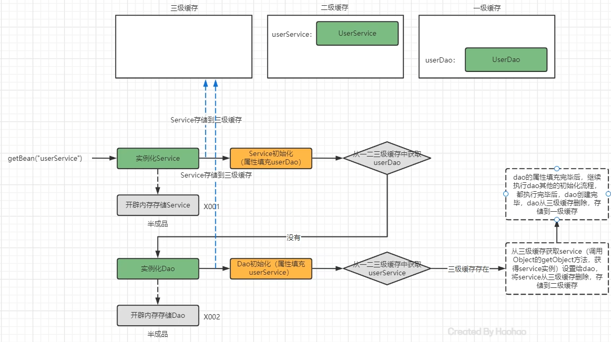
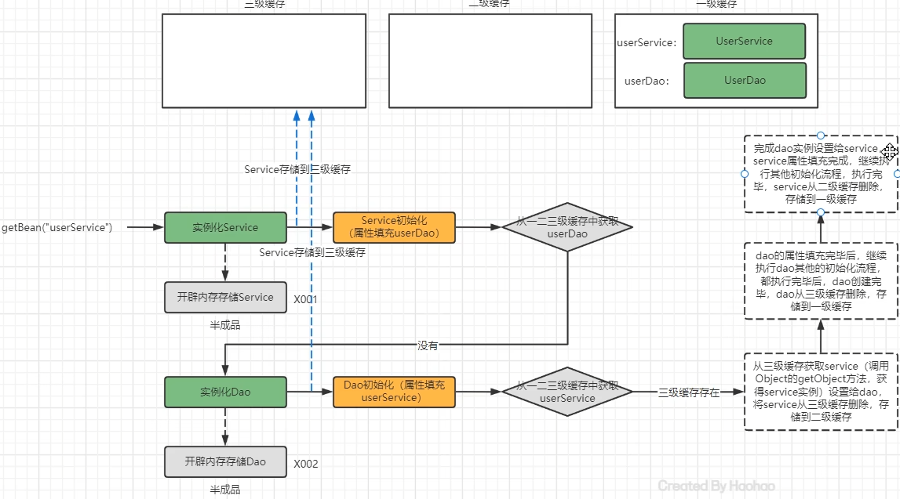
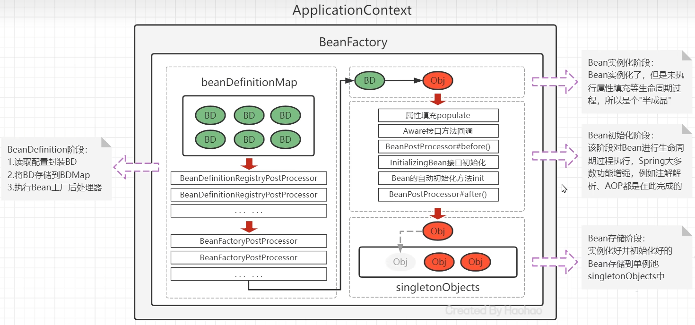

# 这是一个个人学习Spring的项目
## 基于SpringBean的配置详解
+ bean id="" class="" Bean的id和全限定名配置
+ name="" 通过name设置Bean别名
+ scope="" Bean的作用范围
+ lazy-init="" Bean的初始化时机，是否延迟加载，BeanFactory模式下失效
+ init_method="" 实例化后自动执行的初始化方法
+ destroy_method="" 实例销毁前的方法
+ autowire="" 设置自动注入模式，按类型byType，按名字byName
+ factory-bean="" 指定哪个工厂Bean的哪个方法完成Bean的创建
## 三种工厂方式
+ 静态工厂：如果类别的构造方法为静态，可以使用静态工厂；用工厂方式实例化Bean可以实现在Bean创建之前做一些业务逻辑
+ 动态工厂：针对没有静态构造方法的类，实例工厂适用于根据对象状态或其他条件来决定创建什么样的实例
+ 通过实现FactoryBean接口规范延迟实例化Bean，单例，创建容器时就实例化了BeanFactory并存储在了FactoryBeanObjectCache中，
  当需要获取Bean时再通过工厂的getObject去实例对象
## Bean的实例化过程
+ 加载xml配置文件，解析获取配置中的每个<bean>的信息，封装成一个个的BeanDefinition对象;
+ 将BeanDefinition存储在一个名为beanDefinitionMap的Map<String,BeanDefinition>中;
+ ApplicationContext底层遍历BeanDefinitionMap，通过反射创建Bean实例对象;
+ 创建好的Bean实例对象，被存储到一个名为singletonObjects的Map<String,Object>中;
+ 当执行applicationContext.getBean(beanName)时，从singletonObjects去匹配Bean实例返回.

## Spring的后处理器
Spring的后处理器是Spring对外开发的重要扩展点，允许我们介入到Bean的整个实例化流程中来，以达到动态注册BeanDefinition，动态修改BeanDefinition，以及动态修改Bean的作用。Spring主要有两种后处理器:
+ BeanFactoryPostProcessor:Bean工厂后处理器，**在BeanDefinitionMap填充完毕，Bean实例化之前执行；**
+ BeanPostProcessor:Bean后处理器，**一般在Bean实例化之后，填充到单例池singletonObjects之前执行。**

## Spring Bean的生命周期
+ Bean的实例化阶段:Spring框架会取出BeanDefinition的信息进行判断当前Bean的范围是否是singleton的，
  是否不是延迟加载的，是否不是FactoryBean等，最终将一个普通的singleton的Bean通过反射进行实例化;
+ Bean的初始化阶段:Bean创建之后还仅仅是个“半成品”，还需要对Bean实例的属性进行填充、执行一些感知操作。
  接口方法、执行BeanPostProcessor方法、执行InitializingBean接口的初始化方法、执行自定义初始化init方法等。
  该阶段是Spring最具技术含量和复杂度的阶段，Aop增强功能，后面要学习的弹簧的注解功能等、弹簧高频面试题豆豆的循环引用问题都是在这个阶段体现的;
+ Bean的完成阶段:经过初始化阶段，Bean就成为了一个完整的SpringBean，被存储到单例池中去了，即完成了SpringBean的整个生命周期。
## Bean属性注入的几种情况
+ 注入普通属性，string、int或基本类型的集合，直接通过set方法的反射设置进去
+ 注入单向对象引用属性，从容器中getBean获取后通过set方法反射设置进去，如果容器中没有，则先创建被注入对象Bean实例（完成整个生命周期）后，再进行注入操作。
+ 注入双向对象应用属性，比较复杂，涉及循环引用（循环依赖）问题。Spring提供了**三级缓存**的解决方法。

```
public class DefaultSingletonBeanRegistry...{
  //1、最终存储单例Bean成品的容器，即实例化和初始化都完成的Bean，称为一级缓存
  Map<String,Object> singletonObjects = new ConcurrentHashMap(256);
  //2、早期Bean的单例池，缓存半成品对象，且当前对象已经被其他对象应用了，称为二级缓存
  Map<String,Object> earlySingletonObjects = new ConcurrentHashMap(16);
  //3、单例Bean的工厂池，缓存半成品对象，对象未被引用，使用时通过工厂创建Bean，称为三级缓存
  Map<String,ObjectFactory<?>> singletonFactories = new HashMap(16); 
}
```
## 三级缓存图解




## Bean生命周期一图流

## xml整合第三方框架的两种整合方法
+ 不需要自定义名空间，不需要使用Spring的配置文件配置第三方框架本身内容，例如：MyBaits；
+ 需要引入第三方框架命名空间，需要使用Spring的配置文件配置第三方框架本身内容，例如：Dubbo。